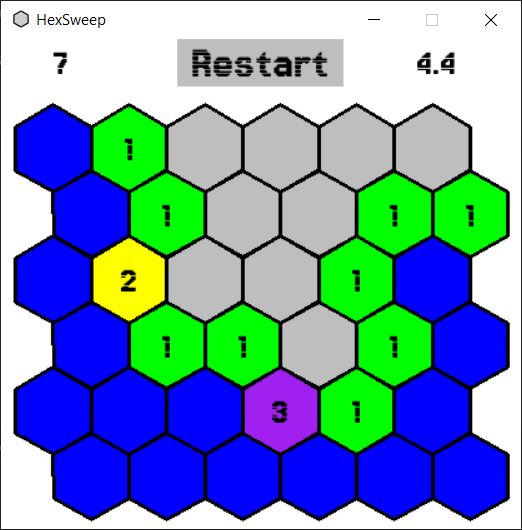

# HexSweep

<br>
HexSweep is a minesweeper game with hexagonal tiles, built using Pygame

# Table of Contents

- [HexSweep](#hexsweep)
- [Table of Contents](#table-of-contents)
  - [Installation](#installation)
  - [Usage](#usage)
  - [Contributing](#contributing)
  - [License](#license)
  - [Release Notes](#release-notes)

## Installation

1. Download the latest TextEditor.exe executable file directly from the [Releases](https://github.com/Vasya-556/HexSweep/releases/tag/v0.1.0) page.
2. Run the executable
* If you see a SmartScreen warning saying "Windows protected your PC" and "Microsoft Defender SmartScreen prevented an unrecognized app from starting."
* Click on More info, then click Run anyway to proceed with running the game.

## Usage

1. Download the code or copy the repository link.
```bash
git clone https://github.com/Vasya-556/HexSweep.git
cd HexSweep
```
2. Run main.py to start the game.
```bash
python main.py
```
3. Optionally, run tests.py to execute the tests.
```bash
python tests.py
```

## Contributing

Pull requests are welcome.

## License

[MIT](LICENSE)

## Release Notes

- **v0.1.0** (11.02.2025)
  - Initial release.